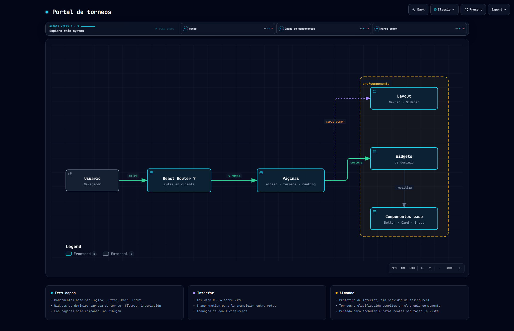

# Portal de torneos

Interfaz para una plataforma de torneos de videojuegos: listado con filtros por juego, ficha de
cada torneo con inscripción, clasificación de jugadores y panel de acceso.

Desarrollado para cliente · React 19 · Vite · Tailwind CSS 4



> Diagrama generado con [Archify](https://github.com/tt-a1i/archify) a partir del código de este
> repositorio. Especificación en [`docs/arquitectura.architecture.json`](docs/arquitectura.architecture.json);
> versión navegable en [`docs/arquitectura.html`](docs/arquitectura.html).

---

## Cómo está organizado

Tres capas, y la regla es que cada una solo conoce la de abajo:

**`components/ui`** — piezas sin dominio ni estado propio: `Button`, `Card`, `Input`. No saben qué
es un torneo. Se pueden llevar a otro proyecto tal cual.

**`components/widgets`** — piezas que sí conocen el dominio: `TournamentCard`, `TournamentFilters`,
`RegistrationModal`, `HeroBanner`. Están construidas sobre las anteriores.

**`pages`** — `Login`, `Dashboard`, `Tournaments`, `Leaderboard`. Componen widgets y les pasan
datos. Apenas dibujan nada por su cuenta.

El marco —`Navbar` y `Sidebar`— vive fuera de las páginas, en `components/layout`, para que no haya
que repetirlo ni mantenerlo en cuatro sitios.

La ventaja de separarlo así es concreta: cambiar el aspecto de todos los botones del portal es
tocar un fichero, y añadir una pantalla nueva no obliga a reescribir ningún componente.

## Rutas

```jsx
<Routes location={location} key={location.pathname}>
  <Route path="/"            element={<Login />} />
  <Route path="/dashboard"   element={<Dashboard />} />
  <Route path="/tournaments" element={<Tournaments />} />
  <Route path="/leaderboard" element={<Leaderboard />} />
</Routes>
```

El `key={location.pathname}` es lo que permite que `framer-motion` anime la salida de una pantalla
y la entrada de la siguiente: al cambiar la clave, React desmonta el árbol anterior en lugar de
reutilizarlo, y eso da a la animación algo que despedir.

En `public/_redirects` está la regla que necesita cualquier aplicación de una sola página en
Netlify, para que entrar directamente en `/tournaments` no devuelva un 404:

```
/* /index.html   200
```

## Alcance

Es la **capa de presentación**. No hay servidor, ni sesión, ni base de datos: los torneos y la
clasificación están escritos como datos de ejemplo dentro de sus propios componentes.

Está montado para que enchufarle datos reales no obligue a tocar la vista — las páginas ya reciben
los datos como una estructura y se limitan a repartirlos entre los widgets.

## Estructura

```
src/
├── App.jsx                    rutas y animación de transición
├── pages/
│   ├── Login.jsx  Dashboard.jsx
│   ├── Tournaments.jsx        listado y filtros
│   └── Leaderboard.jsx        clasificación
└── components/
    ├── layout/    Navbar · Sidebar
    ├── widgets/   HeroBanner · TournamentCard · TournamentFilters · RegistrationModal
    └── ui/        Button · Card · Input
```

## Puesta en marcha

```bash
npm install
npm run dev
```
